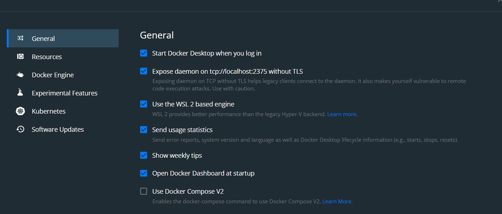

# Installing Ansible using Docker

## Requirements
1. Install docker on your windows machine follow: https://docs.docker.com/desktop/windows/install/
2. Note: When you install Docker make sure to enable the following 
3. Install Visual Code Studio


### Create a Dockerfile that will install Ansible
1. Create a directory in which to test and run the sample code and make it the current directory.
2. Create a new file named Dockerfile.
3. Insert the following Docker commands into the new file.
4. Note edit ``` git config --global user.name "<insert your name>"```
5. Note edit ``` git config --global user.email "<insert your email>"```

```
FROM centos:7

ENV LANG en_US.UTF-8
ENV LC_ALL en_US.UTF-8

RUN yum check-update; \
    yum install -y gcc libffi-devel python3 epel-release; \
    yum install -y python3-pip; \
    yum install -y git; \
    yum install -y wget; \
    yum clean all

RUN pip3 install --upgrade pip; \
    pip3 install --upgrade virtualenv; \
    pip3 install pywinrm[kerberos]; \
    pip3 install pywinrm; \
    pip3 install jmspath; \
    pip3 install requests; \
    python3 -m pip install ansible; \
    ansible-galaxy collection install cisco.ios; \
    ansible-galaxy collection install cisco.iosxr; \
    ansible-galaxy collection install juniper.device; \
    ansible-galaxy collection install f5networks.f5_modules; \
    git config --global user.name "<insert your name>"; \
    git config --global user.email "<insert your email>"; \

WORKDIR /work
```


### Build the Ansible Docker image
Run docker build to build the Docker image used to run Ansible.

```
docker build . -t ansible
```

### Start the Ansible container
Run the docker run to start the Ansible container.

```
docker run -it ansible
```
Key points: 
* By default, Docker containers start detached from the terminal, running in the background.
* The -it option stands for interactive terminal allowing you to run commands inside the Docker container.
To confirm Ansible was installed in the container, run the Ansible command to print its version.

```
ansible --version
```

